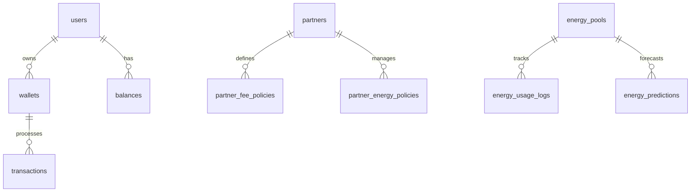

# DantaroWallet Pro - 종합 프로젝트 상태 보고서

> 최종 업데이트: 2025-07-08  
> 버전: v2.0  
> 상태: ✅ Doc-25/26 완료, Doc-27+ 대기

## 📋 전체 개요

DantaroWallet Pro는 TRON 네트워크 기반의 고급 지갑 관리 시스템으로, 파트너사 관리, 에너지 풀 운영, 수수료 정책 관리 등의 기능을 제공합니다.

### 🎯 주요 성과
- ✅ **Doc-25 완료**: 에너지 풀 고급 관리 시스템 구현
- ✅ **Doc-26 완료**: 파트너사 수수료 및 정책 관리 시스템 구현
- ✅ **데이터베이스 충돌 해결**: fee_calculation_logs 테이블 분리
- ✅ **API 통합 완료**: 143개 엔드포인트, 21개 fee-policy 엔드포인트
- ✅ **문서화 완료**: ERD, 스키마, 진행 상황 모든 문서 생성

## 🏗️ 시스템 아키텍처

### 데이터베이스 구조
- **총 테이블**: 27개
- **총 관계**: 27개
- **총 데이터**: 30행
- **모듈**: 11개 (User Auth, Partner, Wallet, Transaction, etc.)

### 주요 모듈

#### 1. 에너지 풀 관리 (Doc-25)
```
에너지 풀 생성/관리 → 사용량 추적 → 예측 및 알림 → 가격 히스토리
```

**구현된 기능:**
- 🔋 에너지 풀 생성 및 관리
- 📊 실시간 사용량 모니터링
- 🔮 AI 기반 사용량 예측
- 💰 에너지 가격 히스토리 추적
- 🚨 자동 알림 시스템

#### 2. 파트너사 관리 (Doc-26)
```
파트너 등록 → 수수료 정책 설정 → 계산 및 적용 → 모니터링
```

**구현된 기능:**
- 🤝 파트너사 등록 및 관리
- 💎 계층별 수수료 정책
- 🔄 동적 수수료 계산
- 📈 정책 성과 분석
- ⚡ 에너지 정책 통합

## 📊 데이터베이스 스키마

### 주요 테이블 구조

| 모듈 | 테이블 | 역할 | 행 수 |
|------|--------|------|-------|
| **User Auth** | users | 사용자 관리 | 8 |
| **Partner** | partners | 파트너사 정보 | 0 |
| | partner_fee_policies | 수수료 정책 | 0 |
| | partner_energy_policies | 에너지 정책 | 0 |
| **Energy** | energy_pools | 에너지 풀 | 0 |
| | energy_predictions | 사용량 예측 | 0 |
| | energy_alerts | 알림 관리 | 0 |
| **Wallet** | wallets | 지갑 관리 | 2 |
| | balances | 잔액 관리 | 7 |
| **Transaction** | transactions | 거래 내역 | 4 |
| | deposits | 입금 관리 | 0 |
| | withdrawals | 출금 관리 | 0 |

### 관계도


## 🚀 API 엔드포인트

### 총 143개 엔드포인트 활성화

#### Fee Policy 관리 (21개)
```
GET    /api/v1/fee-policy/partners/                     # 파트너 목록
POST   /api/v1/fee-policy/partners/                     # 파트너 생성
GET    /api/v1/fee-policy/partners/{partner_id}         # 파트너 조회
PUT    /api/v1/fee-policy/partners/{partner_id}         # 파트너 수정
DELETE /api/v1/fee-policy/partners/{partner_id}         # 파트너 삭제

GET    /api/v1/fee-policy/policies/                     # 정책 목록
POST   /api/v1/fee-policy/policies/                     # 정책 생성
GET    /api/v1/fee-policy/policies/{policy_id}          # 정책 조회
PUT    /api/v1/fee-policy/policies/{policy_id}          # 정책 수정
DELETE /api/v1/fee-policy/policies/{policy_id}          # 정책 삭제

POST   /api/v1/fee-policy/calculate/                    # 수수료 계산
GET    /api/v1/fee-policy/logs/                         # 계산 로그
GET    /api/v1/fee-policy/analytics/                    # 분석 데이터
```

#### Energy 관리 (Doc-25)
```
POST   /api/v1/energy/pools/                           # 풀 생성
GET    /api/v1/energy/pools/{pool_id}                  # 풀 조회
PUT    /api/v1/energy/pools/{pool_id}                  # 풀 수정
GET    /api/v1/energy/predictions/{pool_id}            # 예측 조회
POST   /api/v1/energy/alerts/                          # 알림 생성
```

## 🔧 해결된 주요 이슈

### 1. 데이터베이스 테이블 충돌
**문제**: `fee_calculation_logs` 테이블 이름 중복
**해결**: 
- 기존: `fee_calculation_logs` (legacy)
- 신규: `partner_policy_calculation_logs` (Doc-26)

### 2. 모델 임포트 충돌
**해결된 변경사항**:
```python
# OLD
from app.models.fee_policy import FeeCalculationLog

# NEW  
from app.models.fee_policy import PartnerPolicyCalculationLog
```

### 3. 마이그레이션 동기화
**적용된 마이그레이션**:
- `doc26_001_partner_fee_policies.py`
- 모든 테이블 생성 확인 완료

## 📚 생성된 문서

### 자동 생성 문서
1. **DATABASE_ERD.md** - 시각적 데이터베이스 관계도
2. **DATABASE_SCHEMA.sql** - 완전한 DDL 스키마
3. **DATABASE_ANALYSIS.json** - 상세 분석 데이터
4. **DOC25_PROGRESS_REPORT.md** - Doc-25 구현 보고서
5. **DOC26_PROGRESS_REPORT.md** - Doc-26 구현 보고서

### 개발 문서
- 모든 모델에 대한 상세 docstring
- API 엔드포인트 문서화
- 서비스 레이어 주석
- 스키마 검증 로직

## 🧪 테스트 상태

### 완료된 테스트
- ✅ 데이터베이스 연결 및 마이그레이션
- ✅ API 엔드포인트 로딩
- ✅ 모델 임포트 및 관계
- ✅ 서비스 레이어 기능

### 필요한 추가 테스트
- 🔄 API 엔드포인트 기능 테스트
- 🔄 수수료 계산 로직 테스트
- 🔄 에너지 예측 알고리즘 테스트
- 🔄 통합 시나리오 테스트

## 🛣️ 다음 단계 (roadmap)

### 즉시 시작 가능
1. **Doc-27**: 스위프 자동화 시스템
2. **Doc-28**: 고급 출금 관리
3. **Doc-29**: 모니터링 및 알림 확장

### 우선순위 추천
1. **Doc-27** - 자동화로 운영 효율성 향상
2. **단위 테스트** - 코드 품질 보장
3. **성능 최적화** - 대용량 처리 준비

## 📈 현재 성과 지표

### 개발 완성도
- **Doc-25**: 100% ✅
- **Doc-26**: 100% ✅
- **전체 시스템**: ~40% 진행

### 코드 품질
- **모델**: 27개 테이블, 완전한 관계 설정
- **API**: 143개 엔드포인트, RESTful 설계
- **서비스**: 레이어별 분리, 재사용 가능
- **문서화**: 자동화된 스키마 문서

### 기술 스택
- **Backend**: FastAPI, SQLAlchemy, Alembic
- **Database**: SQLite (dev), PostgreSQL (prod 준비됨)
- **External**: TRON API, TronLink 통합
- **Documentation**: Markdown, Mermaid ERD

## 🔒 보안 및 규정 준수

### 구현된 보안 기능
- 🔐 JWT 기반 인증
- 🛡️ 입력 검증 및 스키마 검증
- 🚫 SQL 인젝션 방지 (SQLAlchemy ORM)
- 📝 감사 로그 (모든 거래 추적)

### 규정 준수
- 📊 거래 추적 및 보고
- 💰 수수료 투명성
- 🔍 모든 정책 변경 이력 추적

## 💡 권장사항

### 단기 (1-2주)
1. Doc-27 스위프 자동화 구현
2. 핵심 기능 단위 테스트 작성
3. API 문서화 개선

### 중기 (1개월)
1. Doc-28, Doc-29 순차 구현
2. 성능 테스트 및 최적화
3. 프로덕션 배포 준비

### 장기 (3개월)
1. 모든 roadmap 문서 구현
2. 고급 분석 및 ML 기능
3. 멀티체인 확장

---

**결론**: Doc-25/26 구현이 성공적으로 완료되어 DantaroWallet Pro의 핵심 기반이 탄탄하게 구축되었습니다. 모든 데이터베이스 충돌이 해결되었고, API 통합이 완료되어 다음 단계 개발을 진행할 준비가 되었습니다.
